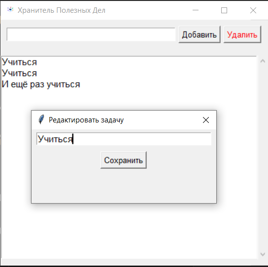

# Хранитель полезных дел 📝

Простое оконное приложение для управления списком задач.
Сохраняет задачи между перезапусками. Создано с помощью `Python` и `tkinter`.

## ✨ Возможности
- Добавление задач через поле ввода
- Автомотическое сохранение в файл
- Работает без интернета
- Имеет собственную иконку!

## ▶ Как запустить
### Вариант 1: Из исходников (нужен `Python`)
1. Установите `Python 3.10+`
2. Запустите `todo_gui.py`

### Вариант 2: Готовый `.exe` (`Windows`)
→ Скачайте последнюю версию из [Releases](https://github.com)

## 🛠 Технологии
- `Python 3`
- `tkinter` (встроенная `GUI`-библиотека)
- `pyinstaller` (для сборки `.exe`)

Создано с ❤ в Королевстве Кодекс.